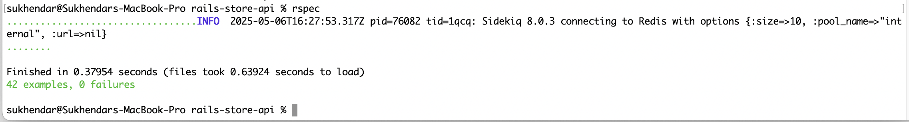

# Rails Store API

This is the backend API built with Ruby on Rails 8. It exposes RESTful endpoints to manage Stores, Items, and Ingredients.

---

## Features

- Rails 8 API-only application
- PostgreSQL database
- JWT authentication (`/signup`, `/login`)
- Nested relationships:
    - Store `has_many` Items
    - Item `has_many` Ingredients
- Sidekiq + Redis for background jobs (For sending emails on store creation)
- RSpec test coverage for models and controllers
- Dockerized with `Dockerfile` and `docker-compose.yml`

---

## Prerequisites
```bash
git clone https://github.com/sukendhar/rails-store-api.git
git clone https://github.com/sukendhar/react-store-ui.git
```

To install react-scripts along with other packages from package.json from `react-sore-ui` app.
```bash
cd react-store-ui
npm install 
```
then goto 
```bash
cd rails-store-api
```

## Docker Setup

### 1. Build and Start Services

```bash
docker-compose up --build
```

### 2. Create and Migrate Database
After the services are up, you need to create, migrate and seed the database. You can do this by executing the following command in new terminal:

```bash
docker-compose exec backend bin/rails db:create db:migrate db:seed
```

### 3. Access

- Rails API: [http://localhost:3000](http://localhost:3000)


## Setup (Without Docker)

```bash
git clone https://github.com/sukendhar/rails-store-api.git
cd rails-store-api
bundle install
rails db:create db:migrate db:seed
rails s
```

### Rspec Tests in local
As docker running in production mode, So we can not run rsec test in docker. Run the tests in local, use the following command:

```bash
bundle exec rspec
```
---

## API Endpoints

### Authentication

- `POST /signup`
- `POST /login`

### Base URL for Stores, Items, and Ingredients
- `http://localhost:3000/api/v1`

### Stores

- `GET /stores`
- `POST /stores`
- `GET /stores/:id`
- `PUT /stores/:id`
- `DELETE /stores/:id`

### Items

- `GET /stores/:store_id/items`
- `POST /stores/:store_id/items`
- `GET /items/:id`
- `PUT /items/:id`
- `DELETE /items/:id`

### Ingredients

- `GET /items/:item_id/ingredients`
- `POST /items/:item_id/ingredients`
- `GET /ingredients/:id`
- `PUT /ingredients/:id`
- `DELETE /ingredients/:id`

### Screenshots

### Rspec tests


### Sidekiq sending notification


### API responses


